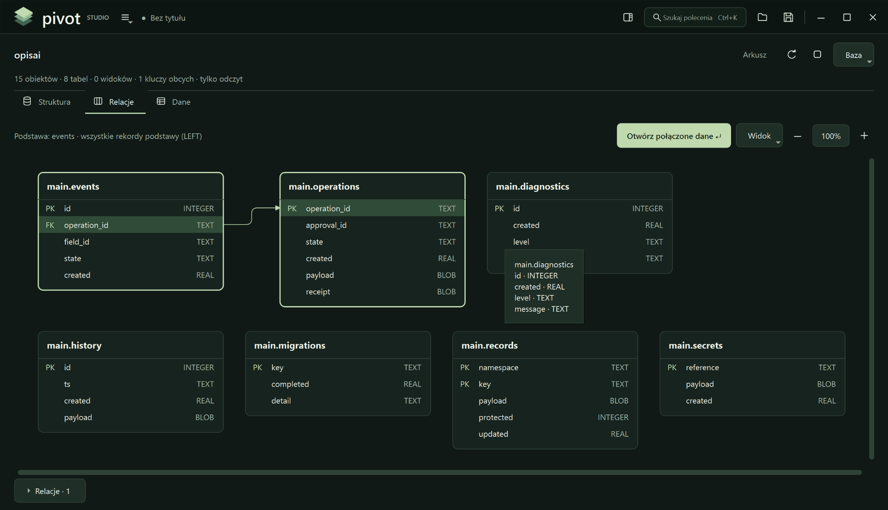

<h1 align="center">Pivot Studio</h1>
<p align="center"><strong>Arkusz. Bazy danych. Relacje. Jedna przestrzeń pracy.</strong></p>
<p align="center">Natywne Qt Widgets · jeden plik Python · lokalna praca · bez wstążki</p>

**Pivot Studio** łączy edytowalny arkusz kalkulacyjny z eksploratorem baz, mapą relacji i tabelami przestawnymi. Otwierasz XLSX albo SQLite, oglądasz strukturę, łączysz powiązane tabele i analizujesz dane bez ręcznego przenoszenia ich między aplikacjami.

**Wydanie rozwojowe 0.7.1.** Nie jest pełnym zamiennikiem Excela ani certyfikowanym narzędziem bazodanowym.

[Uruchomienie](#uruchomienie) · [Możliwości](#możliwości) · [Zrzuty](#zrzuty) · [Ograniczenia](#ograniczenia) · [Licencja](#licencja)


*Rzeczywisty widok Windows z 0.7.0. Wersja 0.7.1 dodaje wykaz licencji, bez przebudowy diagramu.*

## Uruchomienie

Pobierz **`PivotStudio.py`**, zapisz go lokalnie i uruchom:

```console
py PivotStudio.py
```

Na Linux/macOS: `python3 PivotStudio.py`.

Potrzebny jest **64-bitowy CPython 3.10–3.14** oraz **Tcl/Tk (Tkinter)**. Dla pełnego zestawu opcjonalnych sterowników użyj Pythona 3.11 lub nowszego; przypięty sterownik Firebirda nie obsługuje 3.10. Dostępność bibliotek zależy również od systemu i architektury. Windows jest głównym środowiskiem docelowym; pozostałe platformy nie zostały w pełni zweryfikowane.

Przed pierwszym pobieraniem pojawia się okno przygotowania. Wybierasz **Publiczne PyPI** albo **Własne Artifactory** i wpisujesz własny adres indeksu. Dostępne są opcjonalne ustawienia CA, proxy i pakietów offline. Biblioteki trafiają do prywatnego środowiska. Hasło repozytorium nie jest zapisywane, a błąd Artifactory nie przełącza instalatora automatycznie na PyPI.


*Uruchomiony Tkinter 0.7.1 na Linux/Xvfb. Adres example.com jest wyłącznie przykładem, nie domyślnym firmowym serwerem.*

**Do uruchamiania i przekazywania aplikacji wystarczy sam plik `.py`.** README i screenshoty służą prezentacji repozytorium. Interpreter i biblioteki są osobnymi składnikami — program nie jest samodzielnym plikiem EXE.

## Możliwości

| Obszar | Co oferuje Pivot Studio |
|---|---|
| **Arkusz** | Kolumny A–XFD, numery wierszy, adres i pasek formuły, edycja komórek, kopiowanie zakresów, cofanie, podstawowe formatowanie, zakładki i zoom. Wirtualne adresowanie nie znosi limitów liczby zapisanych komórek. |
| **Pliki** | XLSX z wieloma arkuszami, CSV/TSV, lokalne kopie robocze i eksport do nowej kopii XLSX. |
| **Bazy** | Katalog tabel, widoków, kolumn, kluczy, indeksów i innych obiektów. Dane stronicowane tylko do odczytu. SQLite oraz opcjonalne adaptery H2, Firebird i Oracle. |
| **Relacje** | Mapa zadeklarowanych kluczy obcych. Zaznacz powiązane tabele i naciśnij Enter, aby otworzyć wspólne dane przez LEFT/INNER JOIN. Niejednoznaczność wymaga wyboru. |
| **Analizy** | Wiersze, kolumny, miary, filtry, sumy, średnie i liczby unikalne. Pivot i wykres z zakresu; obliczenia bazodanowe wykonywane u źródła. |
| **Projekty** | `.pivot` v4, opcjonalne dołączanie przygotowanych danych, zapisane plany JOIN i odczyt starszych projektów. Kopia przed nadpisaniem starszego formatu. |
| **Licencje** | **Pomoc → Technologie i licencje**: lokalne wersje bibliotek, deklaracje, warunki, źródła, teksty licencji oraz kopiowanie i eksport wykazu. |

## Pierwsze kroki

Otwórz **menu → Pomoc → Otwórz przykład**, aby zobaczyć fikcyjne dane. Własny XLSX możesz przeciągnąć na okno, a później przełączać arkusze zakładkami na dole.

Upuszczenie pliku SQLite otwiera eksplorator bazy. W **Relacjach** zaznacz powiązane tabele i naciśnij **Enter**. To odczyt wspólnych danych, nie edycja bazy ani tworzenie fizycznej tabeli. Funkcje i polecenia można wyszukiwać przez **Ctrl+K**.

## Zrzuty

<details>
<summary>Arkusz oraz pozostałe warianty okna przygotowania</summary>

### Arkusz


*Historyczny zrzut Windows z 0.5.0, pokazujący układ arkusza. Późniejsze wersje poprawiły siatkę i kolory zaznaczenia.*

### Publiczne PyPI


### Jasny motyw przygotowania


*Zrzuty instalatora: rzeczywisty Tkinter 0.7.1 na Linux/Xvfb, bez uruchamiania pobierania. Nie potwierdzają zachowania ramki Windows. Zrzuty aplikacji zostały przycięte bez paska zadań. Nie dodano makiety nieuruchomionego okna licencji.*

</details>

## Ograniczenia

Program nie zapewnia pełnej zgodności z Excelem, makrami ani wszystkimi obiektami i formułami XLSX. Przy pracy z ważnymi plikami zachowaj oryginały i sprawdź eksportowaną kopię.

Źródła baz pozostają tylko do odczytu. Edytujesz lokalny arkusz albo świadomie utworzoną kopię danych. **„Kopia strony → arkusz” obejmuje bieżącą stronę, nie cały wynik.** Płaski JOIN może powielać miary tabel nadrzędnych; pivot nie jest wielotabelowym modelem miar Excela.

Aplikacja nie ma wbudowanej telemetrii, lokalnego serwera HTTP ani WebEngine i nie wysyła automatycznie skoroszytów. Sieć jest używana przy wybranej instalacji pakietów, połączeniu z bazą oraz po jawnym otwarciu źródła dokumentacji. Projekty, importy i migawki **nie są szyfrowane**.

Nowy dialog licencji 0.7.1 nie został sprawdzony w uruchomionym PySide6 ani na Windows w środowisku przygotowania wydania. Testy rdzenia i Tkintera nie zastępują odbioru GUI. Adaptery H2, Firebird i Oracle wymagają prób na rzeczywistych instancjach.

## Licencja

Kod aplikacji: [MIT](LICENSE). Biblioteki, Java i klienci baz zachowują odrębne licencje i wymagania. Deklaracje, warunki i dostępne źródła znajdziesz w **Pomoc → Technologie i licencje**; wykaz nie zastępuje pełnego audytu konkretnej dystrybucji.

Repozytorium nie zawiera bibliotek, plików JAR/DLL, fontów, gotowego venv ani prywatnych baz i projektów.
