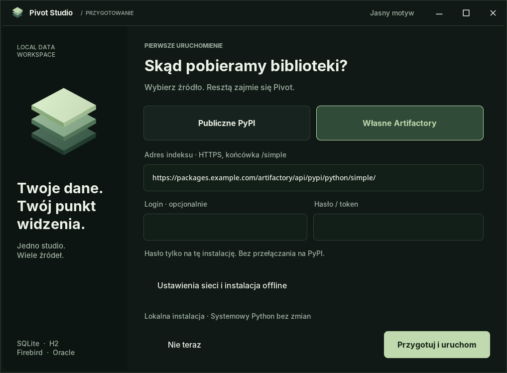

![Pivot Studio — od komórek do odpowiedzi. Zaznacz powiązane tabele, naciśnij Enter i otwórz wspólne dane.][hero]

<h1 align="center">Pivot Studio</h1>

<p align="center">
<b>Swoboda arkusza. Struktura bazy. Siła tabel przestawnych.</b><br>
Jedna lokalna aplikacja w pliku <code>PivotStudio.py</code>. Bez przeglądarki i bez rozbudowanej wstążki.
</p>

<p align="center">
<a href="https://github.com/guziczak/pivotstudio/raw/refs/heads/main/PivotStudio.py"><b>Pobierz PivotStudio.py ↓</b></a>
&nbsp; · &nbsp;
<a href="#szybki-start">Uruchom</a>
&nbsp; · &nbsp;
<a href="#zobacz-jak-pracujesz">Zobacz, jak pracujesz</a>
&nbsp; · &nbsp;
<a href="#status-i-ograniczenia">Status i ograniczenia</a>
</p>

---

Masz arkusz do uporządkowania? Bazę, której strukturę chcesz poznać? Dwie tabele, które dopiero razem odpowiadają na pytanie? **Pivot Studio łączy te zadania w jednym miejscu:** od komórek, przez mapę relacji i wspólne rekordy, po podsumowanie.

Zaczynasz od pliku. Narzędzia otwierasz wtedy, gdy ich potrzebujesz.

## Szybki start

Pobierz **[PivotStudio.py](https://github.com/guziczak/pivotstudio/raw/refs/heads/main/PivotStudio.py)** i uruchom:

```powershell
py PivotStudio.py
```

**Potrzebujesz Pythona 3.10–3.14, 64-bit, z Tcl/Tk.** Pierwszy start otwiera wybór **publicznego PyPI** albo **własnego Artifactory**, a następnie przygotowuje prywatne środowisko bibliotek. Domyślnie zaznaczone jest także przygotowanie pakietów sterowników baz danych; wybór można zmienić przed pobraniem. Nie musisz ręcznie wykonywać poleceń `pip`.

Od razu możesz upuścić XLSX lub SQLite na okno. Bez własnych danych: **menu → Pomoc → Otwórz przykład**.

<details>
<summary><b>Wymagania, inne systemy i opcjonalne sterowniki</b></summary>

Windows jest główną platformą docelową. Na Linux/macOS uruchomienie to `python3 PivotStudio.py`; dostępność bibliotek zależy od platformy, a pełny odbiór tych systemów pozostaje otwarty.

Dla wszystkich opcjonalnych sterowników potrzebny jest **Python 3.11 lub nowszy** — przypięty sterownik Firebirda nie obsługuje Pythona 3.10.

| Źródło | Dodatkowe składniki |
| :--- | :--- |
| **SQLite** | Obsługa w Pythonie; bez osobnego serwera. |
| **H2** | JPype1, zgodna 64-bitowa Java i wskazany JAR H2 2.x. |
| **Firebird** | `firebird-driver` i zgodna biblioteka klienta Firebird. |
| **Oracle** | `python-oracledb`; w trybie Thick także Oracle Client. |

Biblioteki i interpreter są osobnymi składnikami. Jeden plik `.py` oznacza prostą dystrybucję kodu aplikacji, nie samodzielny plik EXE.

</details>

## Zobacz, jak pracujesz

### 01 · Otwórz bazę, nie formularz

Przeciągnij plik SQLite na okno. Dostajesz **katalog tabel, widoków, kolumn, kluczy i indeksów** — bez obowiązkowego tworzenia analizy. Przełącz się na **Relacje**, żeby zobaczyć, co z czym się łączy.

Powiązane tabele są blisko siebie. Linie prowadzą między polami kluczy. Mapę możesz przesuwać i powiększać; ręczny układ pozostaje po powrocie z danych.

![Mapa struktury bazy: zaznaczone events i operations, wyróżnione pola klucza i polecenie otwarcia połączonych danych.][relations]

### 02 · Zaznacz. Enter. Wspólne dane.

Zaznacz powiązane tabele przez **Ctrl+klik** lub prostokąt i naciśnij **Enter**. Pivot otworzy wspólną kartę według zadeklarowanej relacji — bez przepisywania kluczy i bez ręcznego pisania SQL.

Na przykład `events.operation_id → operations.operation_id`: zdarzenie i przypisana do niego operacja w jednym wierszu. Nagłówki wskazują pochodzenie pól, a rodzaj połączenia można zmienić między **wszystkimi rekordami podstawy (LEFT)** i **tylko dopasowanymi (INNER)**. Gdy relacja jest niejednoznaczna, wybierasz ją jawnie.

![Wynik połączenia events i operations: wspólna tabela z nazwami źródeł w nagłówkach, filtrem i kartą wyniku.][joined]

<sub>Identyfikatory operacji, zatwierdzeń i znaczniki czasu na zdjęciu zamaskowano.</sub>

### 03 · Z rekordów zrób odpowiedź

**Region do wierszy. Miesiąc do kolumn. Kwota do wartości.** Tak powstaje podsumowanie, które można filtrować, zapisać i wyeksportować. Dostępne są między innymi sumy, średnie, liczba rekordów i liczba wartości unikalnych.

Przykład: **jak rozkłada się sprzedaż między regionami?**

| Region | 2026-01 | 2026-02 | Ogółem |
| :--- | ---: | ---: | ---: |
| Południe | 9 000 | 13 500 | 22 500 |
| Północ | 12 000 | 15 000 | 27 000 |
| Zachód | 7 500 | 11 000 | 18 500 |
| **Ogółem** | **28 500** | **39 500** | **68 000** |

<sub>Fikcyjne dane: wynik obliczony silnikiem Pivot Studio 0.7.2 dla 12 rekordów. To tabela w README, nie zrzut interfejsu.</sub>

Zaznaczenie w arkuszu może stać się źródłem pivota lub wykresu. Połączenie tabel może zasilić analizę pełnego wyniku, a nie tylko aktualnie oglądanej strony. **Przy relacji jeden-do-wielu dobierz właściwy poziom agregacji:** wartość z tabeli nadrzędnej może wystąpić w kilku wierszach JOIN-a.

### 04 · Kiedy potrzebujesz arkusza — masz arkusz

**A, B, C… u góry. 1, 2, 3… z lewej.** Aktywna komórka, pasek formuły, zakresy, zakładki i zoom. Do tego edycja, kopiowanie i wklejanie, cofanie, podstawowe formatowanie i lokalny silnik formuł.

XLSX otwierasz jako skoroszyt z nazwanymi arkuszami. Przełączasz zakładki bez ponownego importowania pliku. Narzędzia **Format**, **Dane** i **Pivot** są pod ręką, ale nie zajmują czterech rzędów ekranu.

![Lokalny arkusz Pivot Studio: kompaktowy nagłówek, pasek formuły, oznaczenia komórek i zakładki na dole.][sheet]

<details>
<summary><b>Praca z klawiaturą</b></summary>

| Klawisz | W arkuszu |
| :--- | :--- |
| **Enter / Shift+Enter** | Zatwierdź wpis i przejdź w dół / w górę. |
| **Tab / Shift+Tab** | Zatwierdź wpis i przejdź w prawo / w lewo. |
| **Escape** | Anuluj niezapisaną edycję komórki. |
| **F2** | Edytuj aktywną komórkę. |
| **Ctrl+C / Ctrl+V** | Kopiuj / wklej zakres. |
| **Ctrl+K** | Wyszukaj polecenie. |

Obsługa zatwierdzania i nawigacji została przebudowana w **0.7.2**. Stan jej weryfikacji jest opisany w sekcji [Status i ograniczenia](#status-i-ograniczenia). Enter na diagramie ma osobne działanie: otwiera zaznaczone dane.

</details>

## Jedno przygotowanie. Twoje źródło bibliotek.

Na pierwszym ekranie wybierasz, skąd pobrać pakiety. **Własny adres Artifactory**, opcjonalny login i hasło/token; dla sieci firmowej także CA i proxy. Jest również możliwość wskazania kompletu pakietów offline.

<p align="center">

</p>

Hasło źródła pakietów nie jest zapisywane. Błąd firmowego indeksu **nie przełącza pobierania samowolnie na PyPI**. Przygotowane biblioteki pozostają w prywatnym środowisku — nie trzeba instalować ich globalnie.

Od **0.7.4** brak sterownika przy połączeniu pokazuje trwały komunikat z przyciskiem **Przygotuj sterownik**. Uszkodzony import ma osobną akcję naprawy; brak klienta natywnego prowadzi do ustawień. To samo okno przygotowania przywraca ostatnie źródło, adres, login i ustawienia sieci. Hasło lub token Artifactory podajesz ponownie; zmiana adresu usuwa wpisany sekret.

Pierwsze przygotowanie sprawdza zestaw podstawowy, następnie wybrane dodatki: Oracle, Firebird, H2/JPype i magazyn poświadczeń. Brak dodatku pozwala jawnie wybrać ponowienie lub uruchomienie sprawdzonego zestawu. Java, JAR H2, fbclient i Oracle Client pozostają oddzielnymi składnikami. Pakiet Oracle w trybie Thin nie wymaga Oracle Client.

Po doinstalowaniu wybierasz **Zapisz i uruchom ponownie** albo **Później**. Pivot zapisuje i ponownie odczytuje prywatną kopię pracy; stare okno zamyka dopiero po potwierdzeniu startu nowego. Kopia nie nadpisuje dotychczasowego pliku projektu: zachowuje jego nazwę i stan niezapisanych zmian. Hasła i zgody na dostęp do bazy nie przechodzą do nowej sesji — przywrócone źródło czeka na **Połącz**.

## Lokalnie, z jasnymi zasadami

**Arkusz edytujesz. Bazę przeglądasz.** Połączenia bazodanowe i ich wyniki pozostają tylko do odczytu. Polecenie **„Kopia strony → arkusz”** tworzy edytowalną kopię bieżącej strony. Eksport XLSX zapisuje nową kopię skoroszytu, nie nadpisuje otwartego oryginału.

**Zapisujesz pracę, nie tylko obraz tabeli.** Projekt `.pivot` zachowuje arkusze, analizy i nazwane plany połączeń. Przygotowane dane można dołączyć do projektu; oryginalny XLSX jest osobną decyzją. Nie jest to automatyczna kopia całego serwera bazodanowego.

**Wiesz, czego używasz.** W **Pomoc → Technologie i licencje** sprawdzisz lokalne wersje składników, deklaracje i warunki, źródła oraz dostępne teksty licencji. Zestawienie można skopiować lub wyeksportować; nieznane wersje wymagają weryfikacji, nie dostają automatycznie zielonego „tak”.

Aplikacja nie ma wbudowanej telemetrii ani WebEngine. Sieć jest potrzebna przy wybranym pobieraniu pakietów, połączeniach z serwerami baz i otwieraniu źródeł dokumentacji. **Projekty, importy i migawki nie są szyfrowane.**

## Status i ograniczenia

**0.7.4 · aktywnie rozwijane wydanie.** Nowe przygotowanie sterowników, kontrolowany restart oraz aktualny złoty znak Przesmyk w **Pomoc → O autorze**. Poprawiono zapis projektu, eksport i tworzenie pivota z zakresu na Windows. Pivot Studio nie jest pełnym zamiennikiem Excela. Obsługa formuł i formatowania ma określony zakres; makra i część obiektów XLSX nie są obsługiwane. Przy ważnych plikach zachowaj oryginał i sprawdź eksportowaną kopię.

Roboczy skoroszyt ma limit **200 000 zapisanych komórek**, a pojedyncza operacja — **100 000**. Plan JOIN obejmuje **2–8 różnych tabel z jednego źródła**. Płaskie połączenie nie jest wielotabelowym modelem miar Excela. Widoczność katalogu bazy zależy od uprawnień konta.

<details>
<summary><b>Stan testów i pochodzenie materiałów</b></summary>

Weryfikacja **0.7.4 na Windows**: zestaw rdzenia obejmuje **414 testów — 412 przeszło, 2 pominięto z powodu braku uprawnienia do dowiązań**. Zestaw przygotowania obejmuje **70 sprawdzonych testów** (pełny przebieg 69 oraz dodatkowa regresja i ponowny przebieg logiki instalatora po poprawce). Rzeczywista instalacja z publicznego PyPI w osobnym katalogu przygotowała wszystkie pięć profili, przeszła `pip check` i importy. Sprawdzono także rzeczywisty restart Qt z kopią niezapisanej pracy i potwierdzeniem startu nowego okna.

Pełny przebieg Qt w trybie `offscreen` liczył 137 testów: pozostało 5 wcześniejszych niepowodzeń dotyczących klawiatury/IME, układu nagłówka i limitu czasu wykazu technologii. Dwa dodatkowe błędy fixture drag/drop poprawiono i sprawdzono osobno. Nowe testy przygotowania, restartu i logo przechodzą. Wynik nie potwierdza wszystkich interakcji w zwykłym oknie Windows. Połączenie z firmowym Artifactory i rzeczywistymi instancjami H2, Firebird oraz Oracle wymaga dostępu do tych systemów.

Instalator sprawdza hashe pobranych plików i ponownie używa wyłącznie zweryfikowanych plików z tego samego źródła. Nie zawiera jeszcze kompletnego, wcześniej zatwierdzonego manifestu hashy wydawców dla wszystkich platform.

Zdjęcia przedstawiają rzeczywiście uruchomioną aplikację, nie makiety. Mapa i wynik JOIN-a pochodzą z Windows, z wersji 0.7.0; arkusz — z udostępnionego zdjęcia sprzed poprawki 0.7.2. Okno przygotowania to Tkinter 0.7.1 na Linux/Xvfb. Baner wykorzystuje fragment autentycznego diagramu. Zrzuty przycięto bez paska zadań; w wyniku JOIN-a zamaskowano techniczne identyfikatory i znaczniki czasu. Nie są to nowe zrzuty GUI 0.7.2.

Mała tabela sprzedaży powyżej powstała z fikcyjnego, dwumiesięcznego zbioru. Jej wartości i sumy obliczono przez `run_pivot()` z niezmienionego kodu 0.7.2 i niezależnie porównano z agregacją SQLite. Nie przedstawia danych użytkownika ani nagrania GUI.

Wbudowane sprawdzenia, uruchamiane jawnie:

```powershell
py PivotStudio.py --self-test       # rdzeń, bez Qt i bez sieci
py PivotStudio.py --bootstrap-test  # przygotowanie i Tkinter, bez pobierania
py PivotStudio.py --ui-test         # prawdziwe kontrolki; wymaga PySide6
```

</details>

## Licencja

Własny kod aplikacji jest dostępny na **[MIT](LICENSE)**. Biblioteki, Java i klienci baz mają odrębne licencje oraz warunki dystrybucji. Wykaz w aplikacji pomaga je sprawdzić, ale nie zastępuje audytu konkretnego zestawu komponentów.

Do przekazania programu wystarczy **`PivotStudio.py`**. W repozytorium są tylko kod, ten README, licencja i obrazy w `docs/screenshots/` — bez dołączonych bibliotek, venv i prywatnych plików baz.

---

<p align="center"><b>Otwórz dane. Zobacz powiązania. Znajdź odpowiedź.</b></p>
<p align="center"><a href="https://github.com/guziczak/pivotstudio/raw/refs/heads/main/PivotStudio.py">Pobierz Pivot Studio</a> · <a href="#szybki-start">Wróć do startu ↑</a></p>

[hero]: docs/screenshots/hero.png
[relations]: docs/screenshots/database-relations.png
[joined]: docs/screenshots/joined-data.png
[sheet]: docs/screenshots/spreadsheet.png
